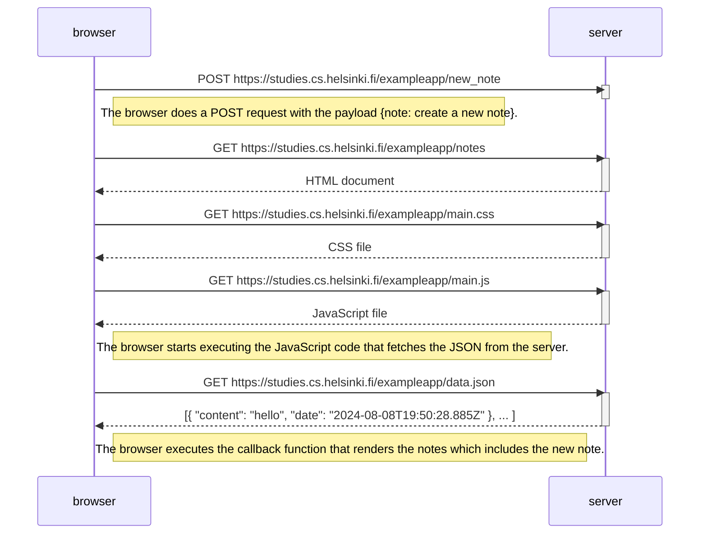

```mermaid
sequenceDiagram
	browser->>server: POST https://studies.cs.helsinki.fi/exampleapp/new_note
    	activate server
    	deactivate server

    Note right of browser: The browser does a POST request with the payload {note: create a new note}.


	browser->>server: GET https://studies.cs.helsinki.fi/exampleapp/notes
	activate server
	server-->>browser: HTML document
	deactivate server

	browser->>server: GET https://studies.cs.helsinki.fi/exampleapp/main.css
	activate server
	server-->>browser: CSS file
	deactivate server

	browser->>server: GET https://studies.cs.helsinki.fi/exampleapp/main.js
	activate server
	server-->>browser: JavaScript file
	deactivate server

    	Note right of browser: The browser starts executing the JavaScript code that fetches the JSON 		from the server.

    	browser->>server: GET https://studies.cs.helsinki.fi/exampleapp/data.json
    	activate server
    	server-->>browser: [{ "content": "hello", "date": "2024-08-08T19:50:28.885Z" }, ... ]
    	deactivate server

    	Note right of browser: The browser executes the callback function that renders the notes which includes the new note.
```
